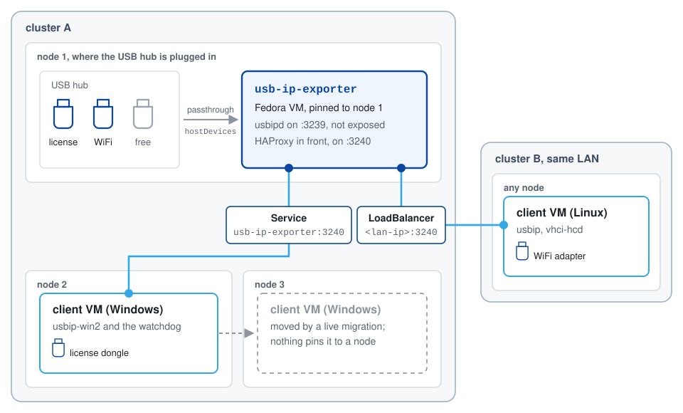

<p align="center">
  <picture>
    <source media="(prefers-color-scheme: dark)" srcset="docs/logo-dark.svg">
    
  </picture>
</p>

# usb-ip-kubevirt

**Live-migrate a VM that needs a USB device.** A license dongle (a hardlock, as 
we call it in Brazil), a Bluetooth adapter, a hardware key, whatever: the device 
stays plugged into one node of an OpenShift Virtualization cluster, and the VM 
that uses it runs, and moves, anywhere, even on another cluster. The VM still 
sees a local USB device; it just gets it over TCP.

## Why not plain USB passthrough?

Because passthrough pins the VM to the node with the device. KubeVirt hands the
physical device to QEMU, and from then on the VM cannot live-migrate: the device
only exists on that one node. This is why your "just migrate it" maintenance
plan fell over.

| | USB passthrough | usb-ip-kubevirt |
| --- | --- | --- |
| Where the VM that uses the device runs | only on the node with the device | any node, or another cluster on the same LAN |
| Live migration of that VM | blocked by KubeVirt | nothing in its spec pins it: a Windows client live-migrated to another cluster kept running, and had its device back about 26 seconds after the switchover (measured) |
| Maintenance on the node with the device | the VM stops | the device drops; the VM keeps running and gets it back when the node returns |
| The client VM reboots or loses the network | the device comes back with the VM | a Windows client re-attaches within one 15-second check, and 30 seconds after a reboot (measured) |
| Several devices | each one pins its VM to that node | one exporter serves them all, each to the VM that attaches it |

## How it works

Two VMs split the job:

- The **exporter**, a small Fedora VM on the device's node, gets the device by
  passthrough and serves it with usbipd behind HAProxy, on TCP 3240. It is
  pinned, and that is fine: it does nothing else.
- The **client**, the VM that runs your workload (Windows or Linux), attaches the
  device over TCP with a usbip client. Nothing in its spec ties it to a node.

Why a VM in the middle, and not usbipd on the node? RHCOS ships no usbip kernel
modules. A Fedora VM has them, and passthrough is how it gets the device.

<picture>
  <source media="(prefers-color-scheme: dark)" srcset="docs/architecture-dark.svg">
  
</picture>

Around the two: a watchdog that tells you when a device leaves the node and
which command brings it back, a dashboard that maps devices, hubs and clients
behind the OpenShift login, and alerts in the OpenShift console.

## See it running

[](https://youtu.be/0eKFwu9JN1s)


It is not only for dongles. A USB WiFi adapter plugged into a node of one
cluster, used by a VM on another, which scans the air through it:


## Quick start

[The quickstart](docs/quickstart.md) has every step, real output and traps
included. The short version, one block per role.

**Requirements.** OpenShift Virtualization installed and working, with
persistent storage, on the cluster with the USB device and on any cluster with
client VMs. MetalLB
[installed](docs/requirements.md#metallb-clients-on-another-cluster) on the
device's cluster if clients live elsewhere. Cluster-admin, and `oc`, `virtctl`
and `jq` on your machine. The VMs boot
[a prebuilt disk image](docs/server.md#boot-without-internet-the-prebuilt-image)
with usbip inside, which the nodes pull from quay.io or its ghcr.io mirror.

### The server, where the dongles are plugged in

**Run these from your machine, not on the node,** in a clone of this repo,
logged in to the cluster whose node holds the dongles.

**1. Find each dongle's vendor:product** on `<node>`, the node they plug into.
RHCOS has no `lsusb`:

```bash
oc debug node/<node> -- chroot /host sh -c 'for d in /sys/bus/usb/devices/[0-9]*; do [ -f $d/idVendor ] || continue; echo "$(basename $d) $(cat $d/idVendor):$(cat $d/idProduct) $(cat $d/product 2>/dev/null)"; done'
```

**2. Deploy the exporter** with the second column; several ids go in quotes,
space separated. Clients on another cluster? Add
`CROSS_CLUSTER=yes LB_IP=<lan-ip>`, a free IP on the node's LAN. Give it about
4 minutes the first time, while the node pulls the 1 GiB disk image, and about
a minute after that.

```bash
DEVICES=0a12:0001 ./scripts/apply.sh
./scripts/status.sh
```

**3. Pick the `<host>` the clients below use**, from the end of `status.sh`:

| The client VM runs | `<host>` |
| --- | --- |
| in `default`, the exporter's namespace | `usb-ip-exporter` |
| in another namespace | `usb-ip-exporter.default.svc.cluster.local` |
| on another cluster | your `LB_IP` |

### A Linux client

**Run these in the Fedora VM that gets the dongle:**

```bash
sudo dnf install -y usbip kernel-modules-extra-$(uname -r) && sudo modprobe vhci-hcd
usbip list -r <host>
sudo usbip attach -r <host> -b <busid>
```

`<busid>` is the one `usbip list` shows. A systemd timer
[keeps it attached](docs/client-linux.md#keep-it-attached).

### A Windows client

**Run these in the Windows VM that gets the dongle**, in an elevated
PowerShell, with the `windows/` scripts and `USBip-0.9.8.0-x64.exe` (from
[the usbip-win2 v.0.9.8.0 release](https://github.com/vadimgrn/usbip-win2/releases/tag/v.0.9.8.0),
the version the hash is for) copied to `C:\usbip-lab\`:

```powershell
cd C:\usbip-lab
.\install-usbip.ps1 -InstallerPath C:\usbip-lab\USBip-0.9.8.0-x64.exe -Sha256 81f426741f7ee2ed991febe24a22daca8400b6ae2f171054e3fb404897e15d39
.\register-watchdog.ps1 -Server <host> -VidPid 0a12:0001
```

The watchdog does the attach and keeps it, across reboots too. `-VidPid` is
that dongle's id from `DEVICES`.

## What is measured

| What | Result |
| --- | --- |
| A Windows client's device dropped | back within one 15-second check; 30 seconds after the client rebooted |
| A Linux client's device detached | back 18 to 36 seconds in three runs, a minute at most, from a systemd timer |
| A `DEVICES` change that moved every slot, five dongles on four clients | each client back on its own devices, 11 to 31 seconds after the exporter was exporting |
| A client vanished without detaching | its device free again 42 seconds later |
| Both clusters powered off and on again | the Windows clients attached their devices by themselves |
| A device unplugged from the node | the other devices kept working; `rediscover.sh`, the fix the watchdog names, runs in 18 to 20 seconds. The watchdog's report of it: not measured yet |
| Exporter boot | exporting 21 to 27 seconds after its VM is running, with or without internet; the first start on a node pulls the disk image first, about 1 GiB, 3 minutes in the lab |
| A client on another cluster | attached through a MetalLB LoadBalancer IP |
| A Windows client live-migrated to another cluster | kept running and kept using its device through the 4-minute memory copy; device back about 26 seconds after the switchover, by its watchdog |

## What does it cost to run?

Next to nothing, apart from the exporter VM. The dashboard with its login
sidecar, the hub discovery and the watchdog, as the OpenShift console showed
them in the lab:


About 70 MiB and a hundredth of a core between the three. The weight is in the
exporter VM: 1 vCPU and 2 GiB in its spec, and, measured with `oc adm top`,
about 1 GiB and under a tenth of a core in use, whether it serves one device or
three.

## Documentation

- [Quickstart](docs/quickstart.md): every step, from the exporter up to the first client VM, with real output.
- [Requirements](docs/requirements.md): MetalLB, user workload monitoring, and the internal registry, only to build the disk image on the cluster.
- [Server side](docs/server.md): the exporter, how a USB device reaches a VM at all, several devices, the disk image, the watchdog, hubs.
- [Windows client](docs/client-windows.md) and [Linux client](docs/client-linux.md).
- [Dashboard](docs/dashboard.md): the map, the login, what it reads and from where.
- [Limitations](docs/limitations.md): security, what is not measured yet, the known traps.
- [Roadmap](docs/roadmap.md): what is next, CI, a whole USB controller for the exporter, an exporter without a VM.

Read [the limitations](docs/limitations.md) before you trust it with a license
dongle.

## License

Apache 2.0. See [LICENSE](LICENSE). The `usb-ip-kubevirt` image carries
third-party files under their own licenses, which it ships in
`/usr/share/licenses/usb-ip-kubevirt/`: Cytoscape is MIT, the Red Hat fonts are
OFL 1.1.
